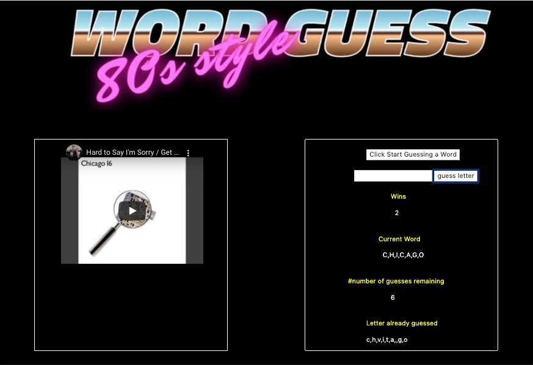

# WORD GUESS GAME #

This app is deployed at:  https://leopard-2019.github.io/WordGuessGames/

A game called Word Guess has been created in the web browser.  The theme for this game is Rock Bands.

1. If the word is "Rush", it is initally displayed like this " _________" when the game starts.

   * As the user guesses the correct letters
  

2. The game displays the number of guesses remaining: (14 has been set for the user), also the letters already 
   guessed: (Letters the user has guessed, displayed like `J O N `).
   
   
   
3. If the word is correctly guessed, a video of the rock band is displayed.

   
   

3. After the user wins/loses the game automatically chooses another word and make the user play it.

